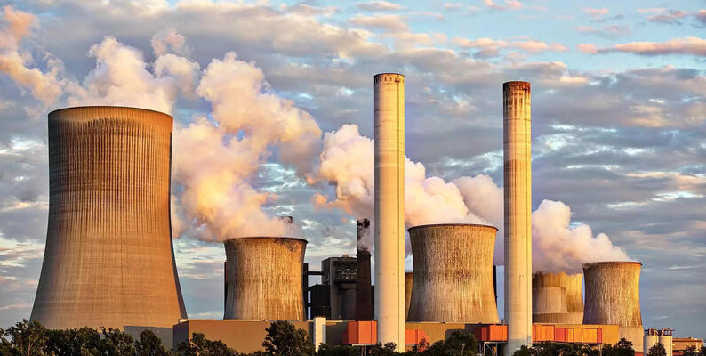

# Laporan Proyek Machine Learning - Alexander Kent So
## Domain Proyek
Proyek machine learning ini mengangkat isu mengenai **lingkungan**, dengan fokus **klasifikasi kualitas udara**

**Latar Belakang**

Polusi udara merupakan ancaman serius bagi ekosistem. Kualitas udara yang buruk tidak hanya memengaruhi kesehatan manusia, tetapi juga merusak lingkungan. Data Indeks Kualitas Udara (AQI) menunjukkan bahwa kualitas udara di Indonesia tergolong buruk, terutama selama musim kemarau. Meskipun demikian, masih banyak orang yang mengabaikan bahaya polusi udara.[[1](https://ayosehat.kemkes.go.id/bahaya-polusi-udara-bagi-kesehatan)] 
Dampak buruk kualitas udara bagi kesehatan meliputi gangguan pada mata, masalah pernapasan, penyakit kardiovaskular, hingga gangguan kognitif.[[1](https://ayosehat.kemkes.go.id/bahaya-polusi-udara-bagi-kesehatan)] 
Melalui proyek ini, diharapkan kesadaran akan pentingnya menjaga kualitas udara yang baik semakin meningkat, sehingga masyarakat Indonesia dapat mengambil langkah yang lebih bijak dalam menangani polusi udara.

## Business Understanding
Dengan adanya model klasifikasi kualitas udara, masyarakat dapat dengan cepat dan bijak mengetahui kondisi udara di sekitar mereka. Hal ini memungkinkan mereka untuk mengambil langkah-langkah yang tepat dalam menghadapi atau mengurangi dampak polusi udara.

### Problem Statements
Berdasarkan latar belakang proyek ini, berikut adalah pernyataan masalah yang ingin diselesaikan:
- Bagaimana cara menentukan kategori kualitas udara di suatu wilayah berdasarkan data yang ada?
- Apa langkah yang dapat diambil masyarakat untuk mengurangi paparan polusi udara berdasarkan prediksi kualitas udara?

### Goals
tujuan dari proyek ini adalah:
- Membangun model klasifikasi kualitas udara di suatu wilayah berdasarkan data yang tersedia.
- Meningkatkan kesadaran masyarakat tentang pentingnya menjaga kualitas udara dengan menyediakan informasi yang mudah diakses mengenai kualitas udara di sekitar mereka.

### Solution statements
- Proyek ini menggunakan 2 algoritma machine learning, yaitu: KNN dan neural network dari TensorFlow. Neural network dipilih karena fleksibilitasnya dalam mengolah berbagai tipe data. KNN dipilih karena merupakan algoritma klasifikasi yang sederhana. Performa dari 2 algoritma ini akan dibandingkan dengan metrik akurasi untuk menentukan algoritma yang lebih baik.

## Data Understanding
Proyek ini menggunakan dataset **Air Quality and Pollution Assessment** oleh **Mujtaba Mateen** yang diambil dari [kaggle](https://www.kaggle.com/datasets/mujtabamatin/air-quality-and-pollution-assessment) pada tanggal 30 Desember 2024.

|*|**Keterangan**|
| -------- | ------- |
| Jumlah data | 5000 |
| Kondisi data | well-documented & clean |
| Usability | 10.00 |

### Variabel fitur:
- **Temperature (°C)**: Suhu rata-rata di wilayah tersebut.
- **Humidity (%)**: Kelembapan relatif yang tercatat di - wilayah tersebut.
- **PM2.5 Concentration (µg/m³)**: Tingkat partikel halus di udara.
- **PM10 Concentration (µg/m³)**: Tingkat partikel kasar di udara.
- **NO2 Concentration (ppb)**: Tingkat nitrogen dioksida di udara.
- **SO2 Concentration (ppb)**: Tingkat sulfur dioksida di udara.
- **CO Concentration (ppm)**: Tingkat karbon monoksida di udara.
- **Proximity to Industrial Areas (km)**: Jarak ke zona industri terdekat.
- **Population Density (people/km²)**: Jumlah penduduk per kilometer persegi di wilayah tersebut.

### Variabel target:
**Air Quality Levels**: Kualitas udara berdasarkan fitur yang diberikan yang digolongkan dalam 4 kategori, yaitu:
- **Good**(udara bersih dengan tingkat polusi rendah)
- **Moderate**(Kualitas udara yang dapat diterima, namun terdapat beberapa polutan)
- **Poor**(Polusi udara yang terlihat dan dapat menyebabkan masalah kesehatan bagi kelompok sensitif)
- **Hazardous**(Udara sangat tercemar yang menimbulkan risiko kesehatan serius bagi populasi).

## Data Preparation
Pada bagian Data Preparation, terdapat 3 metode yang digunakan dalam proyek ini, yaitu:
- **Encoding**      : Mengubah data kategori(teks) menjadi angka. Encoding hanya dilakukan pada kolom 'Air Quality' agar komputer dapat memproses data tersebut dengan lebih efisien.

- **Normalisasi**   : Mengubah data numerik ke dalam skala tertentu. Dalam proyek ini, metode Min-Max Normalization digunakan untuk merubah nilai ke rentang [0, 1]. Tujuannya adalah untuk memastikan semua nilai berada dalam skala yang seimbang, sehingga tidak ada fitur yang mendominasi, serta mempermudah pemrosesan data oleh komputer.

- **train-test data split** : Membagi dataset menjadi  2 subset, yaitu: train dataset untuk melatih model dan test dataset untuk menguji performa model terhadap data baru. Pembagiannya adalah 90% data untuk training dan 10% data untuk test.

## Modeling
Sesuai pernyataaan di **solution statement** proyek ini menggunakan 2 algoritma machine learning, yaitu: **KNN(K-Nearest Neighbors)** dan **neural network tensorflow**.

### **KNN(K-Nearest Neighbour)**:
- Kelebihan  : Sederhana dan memiliki waktu training yang relatif cepat
- Kekurangan : Waktu prediksi relatif lambat dan boros daya komputasi saat dataset cukup besar
- Hyperparameter : 
**k** yaitu jumlah tetangga terdekat yang diperhitungkan untuk proses klasifikasi data baru, proyek ini menggunakan **k=5** yang didapat dari jumlah kategori(4) + 1 untuk mengantisipasi 2 kategori saling seimbang.
**metric** yaitu metode menghitung jarak antar data, proyek ini menggunakan **metric euclidian** untuk menghitung jarak antar data. Hyperparameter lain akan mengikuti setelan default dari sklearn.

### **Neural Network**:
- Kelebihan  : Memiliki waktu prediksi yang relatif cepat dan mampu memprediksi data kompleks
- Kekurangan : Waktu training relatif lambat dan boros daya komputasi
- Arsitektur :
| **Layer (type)** | **Output Shape** | **Param #** |
| input_layer (InputLayer) | (None, 9) | 0 |
| dense (Dense) | (None, 20) | 200 |
| dense_1 (Dense) | (None, 20) | 420 |
| dense_2 (Dense) | (None, 4) | 84 |
- Hyperparameter : 
**Activation function** yang digunakan pada layer **Dense** dan **Dense_1** adalah **ReLU** yang umum digunakan pada hidden layer dan **Softmax** pada **Dense_2** yang cocok untuk multiclass classification. 
**Optimizer** yang digunakan adalah **Adam**. 
**Loss function** yang digunakan adalah **sparse_categorical_crossentropy** yang cocok untuk multiclass classification tanpa memerlukan one-hot encoding. 
**Epoch** yang dipakai adalah **Epoch=10** karena dalam 10 iterasi, model sudah mencapai performa yang cukup baik.

## Evaluation
Metric evaluasi yang digunakan pada proyek ini adalah **akurasi**.
Akurasi adalah rasio prediksi yang benar terhadap total prediksi yang dibuat. Formula untuk menghitung akurasi adalah:

$$
\text{Akurasi} = \frac{\text{Jumlah Prediksi Benar}}{\text{Total Prediksi}}
$$

Dimana:
- **Jumlah Prediksi Benar** adalah jumlah contoh yang diklasifikasikan dengan benar oleh model (baik kelas positif maupun negatif).
- **Total Prediksi** adalah jumlah keseluruhan contoh dalam dataset.

Hasil menunjukan bahwa akurasi dari model neural network(~93%) mengalahkan akurasi dari model KNN(91.2%). Sehingga ditarik kesimpulan bahwa model neural network lebih baik dibanding KNN.